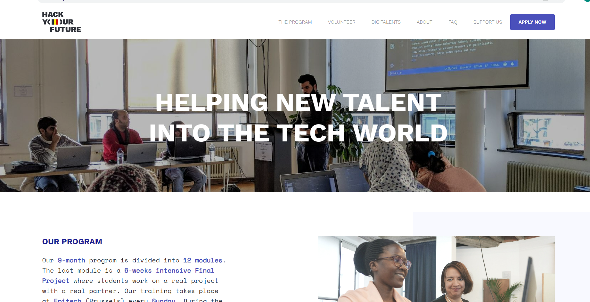

# HYF Website Redesign

> A longer description

A website redesign is a high-level overhaul that involves significantly changing
elements like the code, content, structure, and visuals of your current website
to better serve your visitors.

## Table of contents

- [Name of project](#name-of-project)
  - [Table of contents](#table-of-contents)
  - [General info](#general-info)
  - [Screenshots](#screenshots)
  - [Technologies](#technologies)
  - [Setup](#setup)
  - [Code Examples](#code-examples)
  - [Features](#features)
  - [Status](#status)
  - [Inspiration](#inspiration)
  - [Contact](#contact)
  - [Instructions for use](#instructions-for-use)
  - [Code Quality Checks](#code-quality-checks)
  - [Continuous Integration (CI)](#continuous-integration-ci)
  - [Repo Setup](#repo-setup)

## General info

> A short description

## Screenshots

## Technologies

- Git Hub
- Visual Studio code
- HTML5
- CSS

## Methadologies

- Agile

## Setup

### Clone the Repo

[HYF](http://github.com/HYF-class-21/agile-development-group3-hyf-redesign)

### npm commands

- run npm commands

## Features

To-do list:

- Navbar & Header
- Main Section
  - Info About the Programs
  - Graduation Statistics
  - Core Values & Succes Stories
  - Partners
  - Support Box & Contact
- Footer

## Inspiration

Website of [HYFBelgium](https://hackyourfuture.be/)

## Team Members

- [Neha](https://github.com/Neha-2012)
- [Addi](https://github.com/AddiAlomoush)
- [Xinlou](https://github.com/XinGITLou)
- [Juhar](https://github.com/Juharzeynu)
